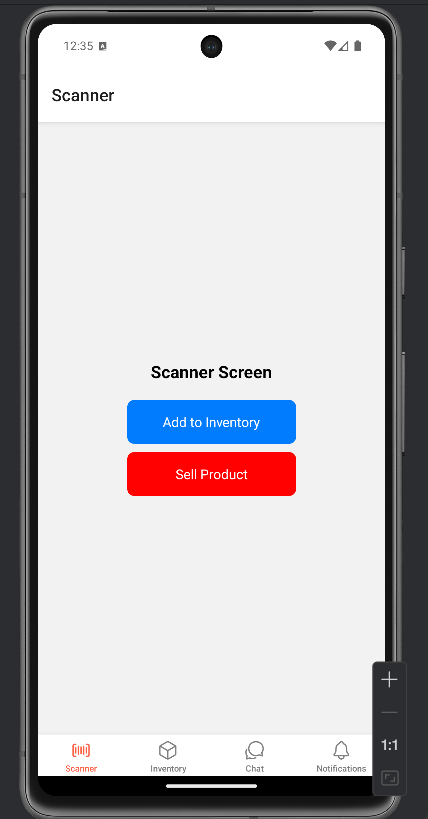
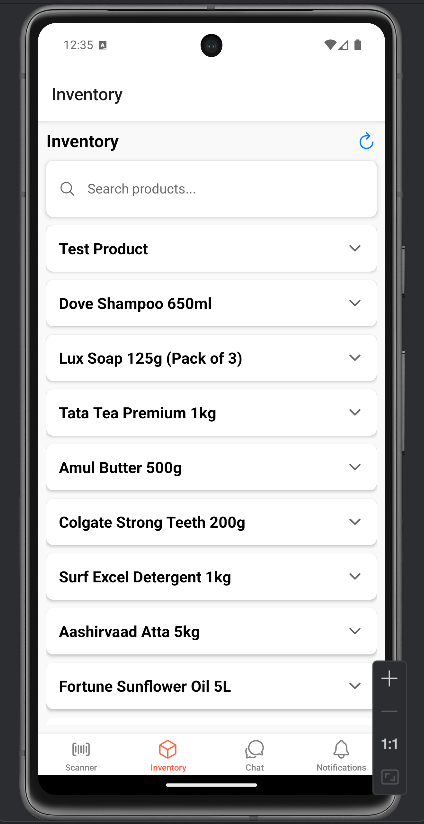
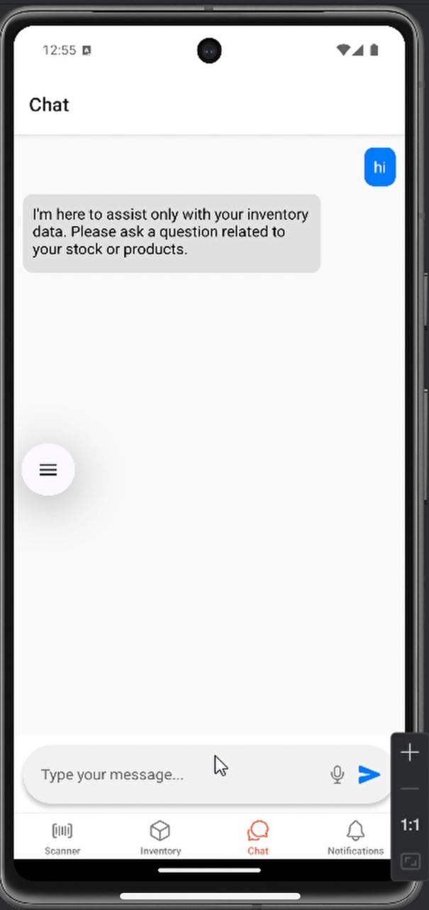
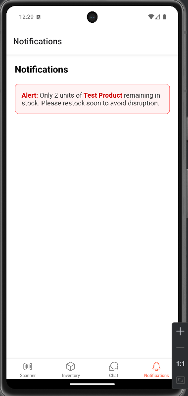

# 🚀 AI-Driven Inventory Management System

<div align="center">


*Transform your inventory management with the power of AI*

</div>

---

## 📋 About The Project

**AI-Driven Inventory Management** is a cutting-edge mobile application that revolutionizes traditional inventory management through intelligent automation and AI-powered assistance. Built with React Native and powered by Google's Gemini AI, this system provides businesses with real-time inventory tracking, smart analytics, and conversational AI support.

### 🎯 Why Choose Our Solution?

- **🧠 AI-Powered Intelligence**: Leverage Google Gemini AI for intelligent inventory insights
- **📱 Cross-Platform Mobile**: Built with React Native for seamless iOS and Android experience
- **☁️ Cloud-First Architecture**: Firebase integration ensures real-time synchronization
- **🔍 Smart Scanning**: Barcode/QR code scanning with automatic product recognition
- **💬 Conversational AI**: Natural language queries for inventory management

## 🎬 Demo Video

<div align="center">

### 🎯 Watch the Magic Happen!

*📹 Demo video showcasing the complete app functionality*

https://github.com/RahulH007/Ai_Driven_Inventory_management_system/blob/main/media/Running%20Devices%20-%20AndroidSDK%202025-07-03%2012-54-53.mp4

**Features Demonstrated:**
- ✅ AI-powered inventory tracking
- ✅ Real-time barcode scanning
- ✅ Intelligent chatbot assistance
- ✅ Advanced analytics dashboard

</div>

---

## ✨ Key Features

### 🏪 **Core Inventory Management**
- **Real-time Inventory Tracking** - Monitor stock levels instantly across all products
- **Product Management** - Add, edit, and delete products with detailed information
- **Stock Alerts** - Automated notifications for low inventory levels
- **Search & Filter** - Advanced search capabilities with multiple filter options

### 🤖 **AI-Powered Features**
- **Intelligent Chatbot** - Ask questions about your inventory in natural language
- **Predictive Analytics** - AI-driven insights for demand forecasting
- **Automated Categorization** - Smart product categorization using machine learning
- **Multi-language Support** - Communicate with AI assistant in multiple languages

### 📊 **Advanced Analytics**
- **Sales Tracking** - Monitor product sales and performance metrics
- **Inventory Reports** - Generate comprehensive inventory reports
- **Trend Analysis** - Identify patterns and trends in inventory movement
- **Dashboard Insights** - Visual representation of key inventory metrics

### 🔧 **Technical Features**
- **Barcode Scanning** - Quick product identification and addition
- **Cloud Synchronization** - Real-time data sync across devices
- **Offline Support** - Continue working even without internet connection
- **Multi-device Access** - Access your inventory from any device

---

## 🛠️ Technology Stack

### **Frontend (Mobile App)**
- **React Native** - Cross-platform mobile development
- **Expo** - Development platform and build tools
- **React Navigation** - Navigation library for screen management
- **React Native Animatable** - Smooth animations and transitions

### **Backend & AI**
- **Python Flask** - RESTful API server
- **Google Gemini AI** - Advanced language model integration
- **Firebase Firestore** - NoSQL cloud database
- **Firebase Authentication** - Secure user authentication

### **Additional Libraries**
- **OpenCV & pyzbar** - Computer vision and barcode scanning
- **Axios** - HTTP client for API communication
- **React Native Gesture Handler** - Enhanced touch interactions

---

## 📱 App Screenshots

<div align="center">

### 🔍 Scanner Screen


### 📋 Inventory Management


### 🤖 AI Chatbot Assistant


### � Notifications


</div>

## 🚀 Getting Started

### Prerequisites

Before running this project, ensure you have the following installed:

- **Node.js** (v16 or higher)
- **Python** (v3.8 or higher)
- **Expo CLI** (`npm install -g expo-cli`)
- **Android Studio** (for Android development)
- **Xcode** (for iOS development - macOS only)

### Installation

#### 1. Clone the Repository
```bash
git clone https://github.com/RahulH007/AI_Driven_Inventroy_managemet_system.git
cd AI_Driven_Inventroy_managemet_system
```

#### 2. Install Dependencies
```bash
# Install React Native dependencies
npm install

# Install Python dependencies
cd python_backend
pip install flask firebase-admin google-generativeai opencv-python pyzbar requests
```

#### 3. Firebase Configuration

1. Create a Firebase project at [Firebase Console](https://console.firebase.google.com/)
2. Enable Firestore Database
3. Download the `google-services.json` file and place it in `android/app/`
4. Download the Firebase Admin SDK JSON file and update the path in `python_backend/Chatbot.py.py`

#### 4. Google AI Configuration

1. Get your Gemini AI API key from [Google AI Studio](https://makersuite.google.com/app/apikey)
2. Replace the API key in `python_backend/Chatbot.py.py`

#### 5. Update Firebase Config

Create or update `src/firebaseConfig.js` with your Firebase configuration:

```javascript
import { initializeApp } from 'firebase/app';
import { getFirestore } from 'firebase/firestore';

const firebaseConfig = {
  // Your Firebase config
};

const app = initializeApp(firebaseConfig);
export const db = getFirestore(app);
```

### Running the Application

#### Start the Python Backend
```bash
cd python_backend
python Chatbot.py.py
```

#### Start the React Native App
```bash
# In the root directory
npm start

# For specific platforms
npm run android  # Android
npm run ios      # iOS
npm run web      # Web
```

---

## 📱 App Structure

```
MyApp/
├── 📱 App.js                    # Main app component
├── 🔧 src/
│   ├── 🧭 navigation/
│   │   └── BottomTabNavigator.js
│   ├── 📺 screens/
│   │   ├── InventoryScreen.js   # Main inventory management
│   │   ├── AddInventoryScreen.js # Add new products
│   │   ├── SellProductScreen.js # Sales management
│   │   ├── ChatScreen.js        # AI chatbot interface
│   │   ├── ScannerScreen.js     # Barcode scanning
│   │   └── NotificationsScreen.js
│   └── 🔥 firebaseConfig.js     # Firebase configuration
├── 🐍 python_backend/
│   ├── Chatbot.py.py           # AI chatbot server
│   └── Scanner.py.py           # Barcode scanning utilities
└── 📱 android/                 # Android-specific files
```

---

## 🎮 Usage Guide

### Adding Products
1. Navigate to the **Scanner** tab
2. Use "Add to Inventory" to manually add products
3. Fill in product details (name, category, price, quantity)
4. Save to add to your inventory

### Managing Inventory
1. Go to the **Inventory** tab
2. View all products with current stock levels
3. Search for specific products using the search bar
4. Tap on products to expand details
5. Edit or delete products as needed

### AI Assistant
1. Open the **Chat** tab
2. Ask questions about your inventory in natural language
3. Examples:
   - "Show me products with low stock"
   - "What's the total value of my inventory?"
   - "Which products sell the most?"

### Sales Tracking
1. Use the **Sell Product** screen to record sales
2. Select products and quantities sold
3. Track sales performance over time

---

## 🔒 Security Features

- **Firebase Authentication** - Secure user login and registration
- **API Key Protection** - Environment-based configuration for sensitive keys
- **Data Validation** - Input validation on both client and server side
- **Secure Communication** - HTTPS for all API communications

---

## 🌟 Future Enhancements

- [ ] **Machine Learning Predictions** - Advanced demand forecasting
- [ ] **IoT Integration** - Smart shelf sensors and automated tracking
- [ ] **Voice Commands** - Voice-controlled inventory management
- [ ] **Augmented Reality** - AR-based inventory visualization
- [ ] **Multi-location Support** - Manage inventory across multiple warehouses
- [ ] **Advanced Analytics** - Business intelligence and custom reports

---

## 🤝 Contributing

We welcome contributions to improve this project! Here's how you can help:

1. **Fork** the repository
2. **Create** your feature branch (`git checkout -b feature/AmazingFeature`)
3. **Commit** your changes (`git commit -m 'Add some AmazingFeature'`)
4. **Push** to the branch (`git push origin feature/AmazingFeature`)
5. **Open** a Pull Request

---

<div align="center">

**⭐ Star this repository if you found it helpful! ⭐**

*Built with :) for small businesses*

---


</div>
